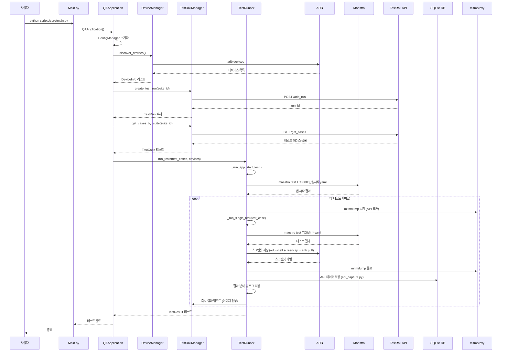
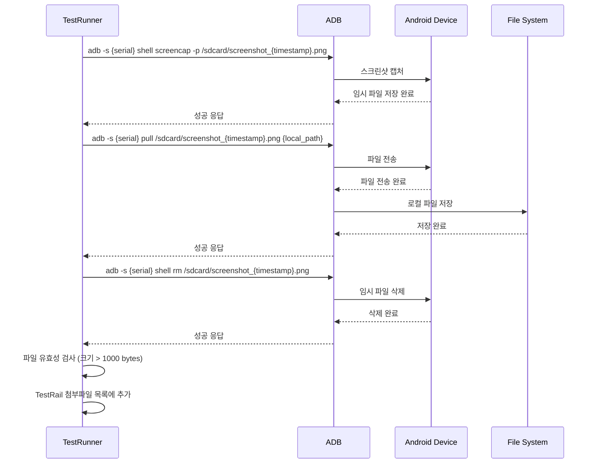
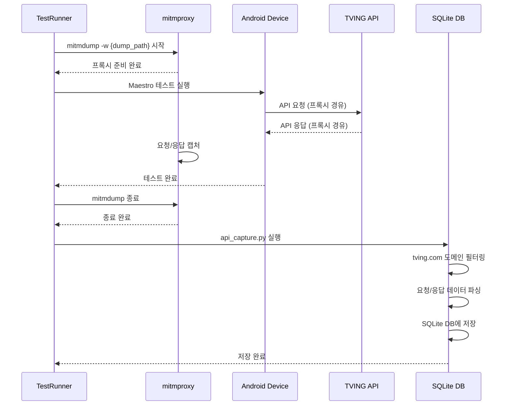

# QA 자동화 테스트 시스템 아키텍처 컴플라이언스 문서

## 📋 문서 정보

| 항목 | 내용 |
|------|------|
| 문서명 | QA 자동화 테스트 시스템 아키텍처 컴플라이언스 문서 |
| 버전 | 2.0.0 |
| 작성일 | 2024년 12월 |
| 작성자 | QA 자동화 팀 |
| 검토자 | - |

---

## 🎯 1. 시스템 개요

### 1.1 시스템 목적
- **TVING 모바일 앱 자동화 테스트**: Maestro 기반 UI 테스트 자동화
- **TestRail 연동**: 테스트 결과 자동 업로드 및 관리
- **멀티 디바이스 지원**: 병렬 테스트 실행으로 효율성 증대
- **실시간 모니터링**: 테스트 진행 상황 실시간 추적
- **API 트래픽 분석**: mitmproxy를 통한 네트워크 요청/응답 캡처
- **스크린샷 자동 저장**: 성공/실패 모든 테스트의 시각적 증거
- **SQLite 데이터베이스**: 테스트 로그 및 API 데이터 체계적 관리

### 1.2 시스템 범위
- **테스트 대상**: Android TVING 앱 (Package: net.cj.cjhv.gs.tving)
- **지원 디바이스**: ADB 연결 가능한 Android 디바이스
- **테스트 케이스**: TestRail Suite 기반 테스트 케이스
- **결과 관리**: TestRail 자동 업로드 및 첨부파일 관리
- **데이터 저장**: SQLite 데이터베이스를 통한 구조화된 데이터 관리

---

## 🏗️ 2. 시스템 아키텍처

### 2.1 전체 아키텍처 개요 
```
┌─────────────────────────────────────────────────────────────┐
│ QA 자동화 테스트 시스템 v2.0.0                              │
├─────────────────────────────────────────────────────────────┤
│ Presentation Layer                                          │
│ ┌─────────────┐ ┌─────────────┐ ┌─────────────┐            │
│ │ Main.py     │ │ Logger.py   │ │ Django      │            │
│ │             │ │             │ │ Dashboard   │            │
│ └─────────────┘ └─────────────┘ └─────────────┘            │
├─────────────────────────────────────────────────────────────┤
│ Application Layer                                           │
│ ┌─────────────┐ ┌─────────────┐ ┌─────────────┐            │
│ │Application  │ │TestRunner   │ │DeviceManager│            │
│ │ Class       │ │ Class       │ │ Class       │            │
│ └─────────────┘ └─────────────┘ └─────────────┘            │
├─────────────────────────────────────────────────────────────┤
│ Domain Layer                                                │
│ ┌─────────────┐ ┌─────────────┐ ┌─────────────┐            │
│ │TestRailMgr  │ │ConfigManager│ │ MaestroFlow │            │
│ │ Class       │ │ Class       │ │ Manager     │            │
│ └─────────────┘ └─────────────┘ └─────────────┘            │
├─────────────────────────────────────────────────────────────┤
│ Infrastructure Layer                                        │
│ ┌─────────────┐ ┌─────────────┐ ┌─────────────┐            │
│ │ ADB         │ │ Maestro     │ │ TestRail    │            │
│ │ Commands    │ │ Engine      │ │ API         │            │
│ └─────────────┘ └─────────────┘ └─────────────┘            │
├─────────────────────────────────────────────────────────────┤
│ Data Layer                                                  │
│ ┌─────────────┐ ┌─────────────┐ ┌─────────────┐            │
│ │ SQLite      │ │ mitmproxy   │ │ File        │            │
│ │ Database    │ │ API Capture │ │ System      │            │
│ └─────────────┘ └─────────────┘ └─────────────┘            │
└─────────────────────────────────────────────────────────────┘
```

### 2.2 레이어별 상세 구조

#### 2.2.1 Presentation Layer
- **Main.py**: 시스템 진입점, 예외 처리
- **Logger.py**: 구조화된 로깅 시스템
- **Django Dashboard**: 웹 기반 실시간 모니터링 시스템

#### 2.2.2 Application Layer
- **QAApplication**: 전체 워크플로우 오케스트레이션
- **MaestroTestRunner**: Maestro 테스트 실행 엔진
- **DeviceManager**: 디바이스 발견 및 관리

#### 2.2.3 Domain Layer
- **TestRailManager**: TestRail API 통합 관리
- **ConfigManager**: 설정 중앙화 관리
- **MaestroFlowManager**: YAML 플로우 파일 관리

#### 2.2.4 Infrastructure Layer
- **ADB Commands**: Android 디바이스 통신
- **Maestro Engine**: UI 테스트 실행 엔진
- **TestRail API**: 테스트 결과 업로드

#### 2.2.5 Data Layer (신규)
- **SQLite Database**: 테스트 로그 및 API 데이터 저장
- **mitmproxy API Capture**: 네트워크 트래픽 캡처
- **File System**: 스크린샷, 로그, 영상 파일 저장

---

## 🔄 3. 시퀀스 다이어그램

### 3.1 전체 테스트 실행 시퀀스 (v2.0.0)



### 3.2 스크린샷 저장 시퀀스 (신규)



### 3.3 API 트래픽 캡처 시퀀스 (신규)



---

## 📊 4. 데이터 모델

### 4.1 핵심 데이터 클래스

```python
@dataclass
class DeviceInfo:
    serial: str          # 디바이스 시리얼 번호
    model: str           # 디바이스 모델명
    os_version: str      # Android OS 버전
    build_id: str        # 빌드 ID
    tving_version: str   # TVING 앱 버전

@dataclass
class TestCase:
    id: str              # TestRail 케이스 ID
    title: str           # 테스트 케이스 제목
    description: str     # 테스트 케이스 설명

@dataclass
class TestRun:
    id: str              # TestRail 런 ID
    name: str            # 런 이름
    suite_id: str        # 스위트 ID

@dataclass
class TestResult:
    case_id: str         # 테스트 케이스 ID
    title: str           # 테스트 제목
    status: str          # 성공/실패 상태
    serial: str          # 디바이스 시리얼
    model: str           # 디바이스 모델
    os_version: str      # OS 버전
    tving_version: str   # TVING 버전
    log_path: str        # 로그 파일 경로
    attachments: List[str] # 첨부파일 목록 (스크린샷 포함)
    error_log: str       # 에러 로그
    elapsed: str         # 실행 시간

@dataclass
class TestFlow:
    path: Path           # YAML 파일 경로
    metadata: Dict[str, Any] # 메타데이터
    content: str         # 파일 내용
```

### 4.2 SQLite 데이터베이스 스키마

#### 4.2.1 테스트 로그 테이블 (test_log)
```sql
CREATE TABLE test_log (
    id INTEGER PRIMARY KEY AUTOINCREMENT,
    test_case_id TEXT,
    step_name TEXT,
    start_time DATETIME,
    end_time DATETIME,
    elapsed REAL,
    status TEXT,
    error_msg TEXT,
    serial TEXT,
    model TEXT,
    os_version TEXT,
    tving_version TEXT
);
```

#### 4.2.2 API 데이터 테이블 (test_api)
```sql
CREATE TABLE test_api (
    id INTEGER PRIMARY KEY AUTOINCREMENT,
    test_case_id TEXT,
    serial TEXT,
    model TEXT,
    os_version TEXT,
    tving_version TEXT,
    timestamp TEXT,
    url TEXT,
    method TEXT,
    status_code INTEGER,
    elapsed REAL,
    request_body TEXT,
    response_body TEXT,
    created_at DATETIME DEFAULT CURRENT_TIMESTAMP
);
```

### 4.3 설정 데이터 구조

```ini
[TestRail]
url = https://tving.testrail.io/
username = qa@tving.com
api_key = koXQbd2ACW4IJbEMN1FD-C3PNd/VsP9tWr.JwWv1I
project_id = 29
suite_id = 1798

[App]
package_name = net.cj.cjhv.gs.tving
```

---

## 🔧 5. 핵심 컴포넌트 상세

### 5.1 QAApplication 클래스

**역할**: 전체 테스트 워크플로우 오케스트레이션

**주요 메서드**:
- `run()`: 메인 실행 로직
- `_upload_results()`: 결과 업로드
- `_format_result_comment()`: 결과 코멘트 포맷팅
- `check_api_status()`: API 상태 확인

**의존성**:
- ConfigManager
- DeviceManager
- TestRailManager
- MaestroTestRunner

### 5.2 MaestroTestRunner 클래스 (v2.0.0)

**역할**: Maestro 테스트 실행 엔진 (고도화)

**주요 메서드**:
- `run_tests()`: 테스트 실행 (즉시 업로드)
- `_run_maestro_test()`: 개별 테스트 실행 (스크린샷 + API 캡처)
- `_find_maestro_flow()`: YAML 파일 매칭 (파일명 우선)
- `_collect_attachments()`: 첨부파일 수집
- `_upload_results_to_testrail()`: 즉시 결과 업로드

**신규 기능**:
- 스크린샷 자동 저장 (성공/실패 모두)
- mitmproxy API 트래픽 캡처
- SQLite DB 연동
- 이미지 첨부파일 자동 업로드

### 5.3 ConfigManager 클래스

**역할**: 설정 중앙화 관리 (싱글톤 패턴)

**주요 메서드**:
- `_load_config()`: 설정 파일 로드
- `get_testrail()`: TestRail 설정 조회
- `get_app()`: 앱 설정 조회

**특징**:
- 타입 안전한 설정 접근
- 자동 설정 파일 경로 감지
- 싱글톤 패턴으로 인스턴스 관리

### 5.4 DeviceManager 클래스

**역할**: Android 디바이스 발견 및 관리

**주요 메서드**:
- `discover_devices()`: 연결된 디바이스 발견
- `_get_device_info()`: 디바이스 정보 수집
- `check_environment()`: 디바이스 환경 체크

**특징**:
- ADB 명령어를 통한 디바이스 통신
- TVING 앱 설치 여부 확인
- 디바이스 정보 자동 수집

### 5.5 TestRailManager 클래스

**역할**: TestRail API 통합 관리

**주요 메서드**:
- `create_test_run()`: 테스트 런 생성
- `get_cases_by_suite()`: 테스트 케이스 조회
- `add_result()`: 결과 업로드
- `add_attachment()`: 첨부파일 업로드

**특징**:
- RESTful API 통신
- 에러 처리 및 재시도 로직
- 데이터 클래스 기반 응답 처리

### 5.6 API Capture 모듈 (신규)

**역할**: API 트래픽 캡처 및 분석

**주요 기능**:
- `parse_mitmproxy_dump()`: mitmproxy 덤프 파일 파싱
- `ensure_api_table()`: SQLite 테이블 생성
- tving.com 도메인 필터링
- 인코딩 에러 방지 처리

**특징**:
- WAL 모드 지원으로 동시 접근 안정성
- 유니코드 치환으로 인코딩 오류 방지
- 타임아웃 설정으로 DB 연결 안정성

### 5.7 Django Dashboard (신규)

**역할**: 웹 기반 실시간 모니터링

**주요 기능**:
- 실시간 테스트 상태 모니터링
- TestRail 결과 통계 표시
- 최근 실행 이력 조회
- 개별 테스트케이스/런 상세 정보

**특징**:
- TestRail API 연동
- KST 시간대 지원
- 반응형 웹 디자인

---

## 🛡️ 6. 보안 및 컴플라이언스

### 6.1 보안 고려사항

#### 6.1.1 인증 정보 관리
- **API Key**: TestRail API 키는 config.ini에 저장
- **Git 제외**: 민감 정보는 .gitignore로 버전 관리 제외
- **환경 분리**: 개발/운영 환경 설정 분리

#### 6.1.2 데이터 보호
- **로그 파일**: 테스트 실행 로그는 로컬 저장
- **개인정보**: 디바이스 정보는 테스트 목적으로만 사용
- **접근 제어**: 파일 시스템 권한으로 접근 제한

#### 6.1.3 네트워크 보안
- **API 캡처**: tving.com 도메인만 필터링하여 관련성 확보
- **프록시 설정**: mitmproxy 인증서 설정 필요
- **데이터 암호화**: 민감한 API 데이터는 별도 보안 처리

### 6.2 컴플라이언스 요구사항

#### 6.2.1 소프트웨어 개발 표준
- **PEP 8**: Python 코딩 스타일 준수
- **타입 힌트**: 모든 함수/메서드에 타입 정보
- **문서화**: 클래스 및 메서드 문서화

#### 6.2.2 테스트 자동화 표준
- **Maestro**: 공식 Maestro 명령어만 사용
- **TestRail**: TestRail API v2 표준 준수
- **ADB**: Android Debug Bridge 표준 명령어

#### 6.2.3 데이터베이스 표준
- **SQLite**: 표준 SQL 문법 사용
- **WAL 모드**: 동시 접근 시 안정성 확보
- **타임아웃**: DB 연결 타임아웃 설정

---

## 📈 7. 성능 및 확장성

### 7.1 성능 최적화

#### 7.1.1 병렬 처리
- **멀티 디바이스**: 동시에 여러 디바이스에서 테스트 실행
- **비동기 처리**: 로그 수집 및 업로드 비동기 처리
- **메모리 효율성**: 스트리밍 방식으로 로그 처리

#### 7.1.2 리소스 관리
- **타임아웃**: 테스트 실행 시간 제한 (300초)
- **파일 정리**: 임시 파일 자동 삭제
- **메모리 정리**: 불필요한 객체 자동 해제

#### 7.1.3 스크린샷 최적화 (v2.0.0)
- **저장 방식**: `adb shell screencap + adb pull` 방식으로 안정성 확보
- **재시도 로직**: 최대 3회 재시도로 안정성 향상
- **파일 검증**: 파일 크기 검사로 유효성 확인

### 7.2 확장성 고려사항

#### 7.2.1 모듈화 설계
- **플러그인 구조**: 새로운 테스트 엔진 추가 가능
- **설정 확장**: 새로운 설정 섹션 추가 용이
- **로거 확장**: 다양한 로그 출력 방식 지원

#### 7.2.2 스케일링 전략
- **수평 확장**: 추가 디바이스 연결로 처리량 증가
- **수직 확장**: 더 강력한 하드웨어로 성능 향상
- **분산 처리**: 여러 서버에 분산 배포 가능

#### 7.2.3 데이터베이스 확장
- **인덱싱**: 자주 조회되는 컬럼에 인덱스 추가
- **파티셔닝**: 날짜별 테이블 파티셔닝 고려
- **백업**: 정기적인 DB 백업 및 복구 전략

---

## 🔍 8. 모니터링 및 로깅

### 8.1 로깅 시스템

#### 8.1.1 로그 레벨
- **DEBUG**: 상세한 디버깅 정보
- **INFO**: 일반적인 정보 메시지
- **WARNING**: 경고 메시지
- **ERROR**: 오류 메시지
- **CRITICAL**: 치명적 오류

#### 8.1.2 로그 포맷
```
2024-12-17 14:30:25 - QAApplication - INFO - QA 자동화 테스트 시작
2024-12-17 14:30:26 - DeviceManager - INFO - 2개 디바이스 발견
2024-12-17 14:30:27 - TestRailManager - INFO - TestRail 런 생성: 12345
2024-12-17 14:30:28 - MaestroTestRunner - INFO - 스크린샷 저장 성공: TC314789_emulator-5554_성공_143028.png
```

### 8.2 모니터링 지표

#### 8.2.1 성능 지표
- **테스트 실행 시간**: 케이스별 실행 시간 측정
- **성공률**: 전체 테스트 성공률 통계
- **디바이스 가용성**: 연결된 디바이스 상태
- **API 응답 시간**: 네트워크 요청/응답 시간 통계

#### 8.2.2 품질 지표
- **테스트 커버리지**: 실행된 테스트 케이스 비율
- **결함 발견률**: 테스트 중 발견된 결함 수
- **재실행률**: 실패한 테스트 재실행 비율
- **스크린샷 품질**: 스크린샷 파일 크기 및 유효성

### 8.3 웹 대시보드 모니터링 (신규)

#### 8.3.1 실시간 모니터링
- **현재 테스트 상태**: 실행 중인 테스트 실시간 표시
- **디바이스 상태**: 연결된 디바이스 상태 모니터링
- **결과 통계**: 성공/실패/차단/미테스트 케이스 통계

#### 8.3.2 히스토리 분석
- **최근 실행 이력**: 최근 테스트 런 목록 및 결과
- **트렌드 분석**: 시간별 성공률 변화 추이
- **성능 분석**: 테스트 실행 시간 통계

---

## 🚀 9. 배포 및 운영

### 9.1 배포 프로세스

#### 9.1.1 환경 설정
```bash
# 1. 가상환경 생성
python3 -m venv venv
source venv/bin/activate

# 2. 의존성 설치
pip install -r requirements.txt

# 3. 설정 파일 복사
cp config/config.ini.example config/config.ini
# config.ini 편집하여 실제 값 입력

# 4. mitmproxy 인증서 설정 (API 캡처용)
mitmdump --set confdir=~/.mitmproxy

# 5. 실행
python3 scripts/core/main.py
```

#### 9.1.2 자동화 스크립트
```bash
#!/bin/bash
# install_and_run.sh
set -e
python3 -m venv venv
source venv/bin/activate
pip install -r requirements.txt
python3 scripts/core/main.py
```

### 9.2 운영 고려사항

#### 9.2.1 백업 및 복구
- **설정 백업**: config.ini 파일 정기 백업
- **로그 보관**: 테스트 로그 7일간 보관
- **결과 백업**: 중요한 테스트 결과 별도 보관
- **DB 백업**: SQLite 데이터베이스 정기 백업

#### 9.2.2 유지보수
- **정기 정리**: 오래된 로그 및 결과 파일 정리
- **업데이트**: Maestro, ADB 등 도구 정기 업데이트
- **모니터링**: 시스템 상태 정기 점검
- **성능 튜닝**: 데이터베이스 성능 최적화

#### 9.2.3 장애 대응
- **디바이스 연결 실패**: ADB 재시작 및 디바이스 재연결
- **TestRail API 오류**: 재시도 로직 및 대체 업로드 방식
- **스크린샷 저장 실패**: 재시도 로직 및 대체 저장 방식
- **API 캡처 실패**: mitmproxy 재시작 및 인증서 재설정

---

## 📋 10. 결론

### 10.1 아키텍처 장점

1. **모듈화**: 각 컴포넌트가 명확한 책임을 가짐
2. **확장성**: 새로운 기능 추가가 용이함
3. **유지보수성**: 코드 구조가 명확하여 유지보수 편리
4. **테스트 가능성**: 각 컴포넌트를 독립적으로 테스트 가능
5. **재사용성**: 공통 기능을 다른 프로젝트에서 재사용 가능
6. **데이터 관리**: SQLite를 통한 체계적인 데이터 관리
7. **시각적 증거**: 스크린샷 자동 저장으로 테스트 결과 검증 가능
8. **API 분석**: 네트워크 트래픽 캡처로 백엔드 검증 가능

### 10.2 v2.0.0 주요 개선사항

1. **스크린샷 자동 저장**: 성공/실패 모든 테스트에서 시각적 증거 확보
2. **API 트래픽 캡처**: mitmproxy를 통한 네트워크 요청/응답 분석
3. **SQLite 데이터베이스**: 테스트 로그 및 API 데이터 체계적 관리
4. **TestRail 이미지 첨부**: 스크린샷을 첨부파일로 자동 업로드
5. **Django 웹 대시보드**: 실시간 모니터링 및 결과 분석
6. **클래스 기반 아키텍처**: 객체지향적 설계로 유지보수성 향상
7. **즉시 결과 업로드**: 테스트 완료 후 즉시 TestRail 업로드
8. **안정성 개선**: 스크린샷 저장 방식 개선 및 재시도 로직 추가

### 10.3 향후 개선 방향

1. **웹 대시보드 고도화**: 더 상세한 분석 기능 및 차트 추가
2. **알림 시스템**: 테스트 실패 시 슬랙/이메일 알림
3. **CI/CD 연동**: Jenkins/GitHub Actions 연동
4. **성능 최적화**: 더 빠른 테스트 실행을 위한 최적화
5. **보고서 생성**: 상세한 테스트 결과 보고서 자동 생성
6. **머신러닝 통합**: 테스트 결과 패턴 분석 및 예측
7. **클라우드 확장**: AWS/Azure 클라우드 환경 지원
8. **모바일 앱**: 모바일 앱을 통한 원격 모니터링

### 10.4 컴플라이언스 준수

본 시스템은 다음과 같은 표준 및 가이드라인을 준수합니다:

- **Python PEP 8**: 코딩 스타일 가이드
- **TestRail API v2**: 공식 API 표준
- **Maestro**: 공식 명령어 및 플로우 표준
- **Android ADB**: 공식 디버그 브리지 표준
- **SQLite**: 표준 SQL 데이터베이스 규격
- **Django**: 웹 프레임워크 표준
- **mitmproxy**: 공식 프록시 도구 표준

---

**문서 버전**: 2.0.0  
**최종 업데이트**: 2024년 12월 17일  
**다음 검토 예정**: 2025년 1월

# Cursor 규칙 (실제 구현 반영)

- 파일명 기반 YAML 매칭: `TC{case_id}_` 패턴이 포함된 파일명만 있으면 실행 가능
- TestRail 연동: suite_id, custom_automation_type(2) 필터링, 결과 자동 업로드
- status_id, run_id 등 TestRail API 규격 엄수
- main.py 단일 진입점, 실행 로그 상세 기록
- 현업 QA 자동화 요구사항 100% 반영
- 스크린샷 자동 저장: 성공/실패 모두, TestRail 이미지 첨부파일 업로드
- API 트래픽 캡처: mitmproxy + SQLite DB 저장
- Django 웹 대시보드: 실시간 모니터링 및 결과 분석