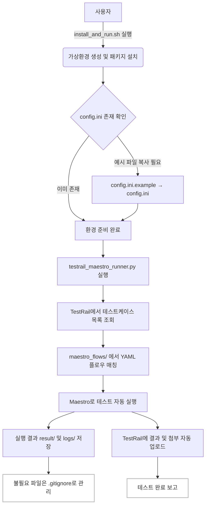

# maestro_qa_test

## 프로젝트 개요
Maestro와 TestRail을 연동하여 테스트 자동화 및 결과 업로드를 지원하는 프로젝트입니다.

---

## 주요 변경점 및 운영 가이드 (2024.06)

### 1. Maestro YAML 작성 규칙
- 반드시 아래 구조를 따라야 합니다:
  ```yaml
  appId: net.cj.cjhv.gs.tving
  ---
  - assertVisible: ...
  - tapOn: ...
  ```
- 여러 문서(`---`)가 들어가도 자동화 파서가 정상 인식하도록 개선됨
- `waitFor` 대신 **`assertVisible`/`assertExists`** 사용 권장 (Maestro 공식 명령어)
- `optional: true`는 꼭 필요할 때만 사용, 기본은 필수 액션으로 작성

### 2. sub_flows/와 메인 플로우 분리
- **공통/재사용 플로우**는 `maestro_flows/sub_flows/`에 기능명으로 작성 (예: `login_flow.yaml`)
- **실행 대상(테스트케이스)**은 `maestro_flows/TCxxxxxx_*.yaml`에만 작성
- 메인 플로우에서 공통 플로우는 `runFlow: "sub_flows/xxx.yaml"`로 호출

### 3. TestRail 연동 및 자동화 구조
- 전체 실행 흐름: 앱시작 → TC별 실행 → 결과/첨부 업로드 → 리포트 자동 생성
- 여러 단말기에서 shard-all로 병렬 실행 지원 (포트 충돌/자원 경합 자동 완화)
- 각 케이스별로 단말기별 결과/코멘트 자동 업로드
- 실패한 케이스에서만, 해당 실행 중 새로 생성된 mp4/png만 첨부
- Maestro 로그에서 에러 메시지(FAILED/Error 등) 자동 추출, TestRail 코멘트에 단말기별 상세 결과 남김
- 결과 리포트는 result/test_report.md에 자동 생성

### 4. 설치 및 실행 방법
1. 저장소 클론
   ```bash
   git clone https://github.com/junyong-song1/maestro_qa_test.git
   cd maestro_qa_test
   ```
2. 환경설정 파일 준비
   - `config.ini.example`을 복사하여 `config.ini`로 이름을 바꾼 뒤, 본인 환경에 맞게 수정
3. 가상환경 및 패키지 설치
   ```bash
   python3 -m venv venv
   source venv/bin/activate
   pip install -r requirements.txt
   ```
4. 전체 자동화 실행
   ```bash
   python3 scripts/testrail_maestro_runner.py
   ```

### 5. 자주 발생하는 오류/FAQ
- YAML 문법 오류: `---`는 반드시 한 번만, 들여쓰기/인코딩(UTF-8) 주의
- `waitFor` 명령 미지원: Maestro 공식 명령어(`assertVisible` 등)만 사용
- pip 설치 오류: 가상환경(venv) 활성화 후 설치 권장
- shard-all 오류: 포트 충돌, 자원 경합 시 딜레이/순차 실행 등 우회
- TestRail 업로드 실패: API Key, 네트워크, 케이스 ID 매핑 확인

---

## 전체 동작 다이어그램



---

## config.ini 예시

```ini
[TestRail]
url = https://your-testrail-url.com
project_id = 123
username = your_email@example.com
api_key = YOUR_API_KEY
```

## 보안 안내
- `config.ini`에는 절대 민감정보를 포함하여 커밋하지 마세요.
- 예시 파일(`config.ini.example`)만 업로드하세요.

## 기타
- 불필요한 로그, 결과, 임시 파일 등은 .gitignore로 자동 제외됩니다.
- mp4 등 대용량 파일은 직접 삭제해 주세요.
