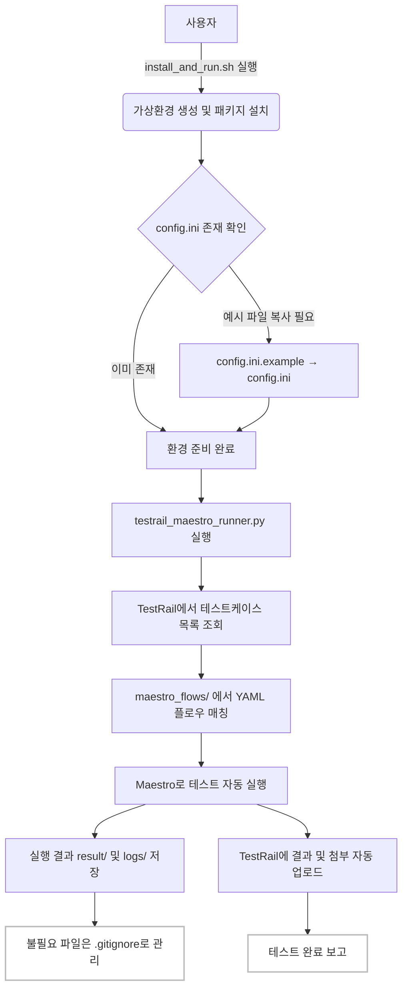

# maestro_qa_test

## 프로젝트 개요
Maestro와 TestRail을 연동하여 테스트 자동화 및 결과 업로드를 지원하는 프로젝트입니다.

---

## 전체 동작 다이어그램



---

## 설치 및 실행 방법

1. 저장소 클론
   ```bash
   git clone https://github.com/junyong-song1/maestro_qa_test.git
   cd maestro_qa_test
   ```

2. 환경설정 파일 준비  
   - `config.ini.example`을 복사하여 `config.ini`로 이름을 바꾼 뒤, 본인 환경에 맞게 수정하세요.
   - 절대 민감정보(API Key 등)는 Github에 올리지 마세요.

3. 설치 및 실행
   ```bash
   bash install_and_run.sh
   ```

## config.ini 예시

```ini
[TestRail]
url = https://your-testrail-url.com
project_id = 123
username = your_email@example.com
api_key = YOUR_API_KEY
```

## 보안 안내
- `config.ini`에는 절대 민감정보를 포함하여 커밋하지 마세요.
- 예시 파일(`config.ini.example`)만 업로드하세요.

## 기타
- 불필요한 로그, 결과, 임시 파일 등은 .gitignore로 자동 제외됩니다.
- mp4 등 대용량 파일은 직접 삭제해 주세요.
